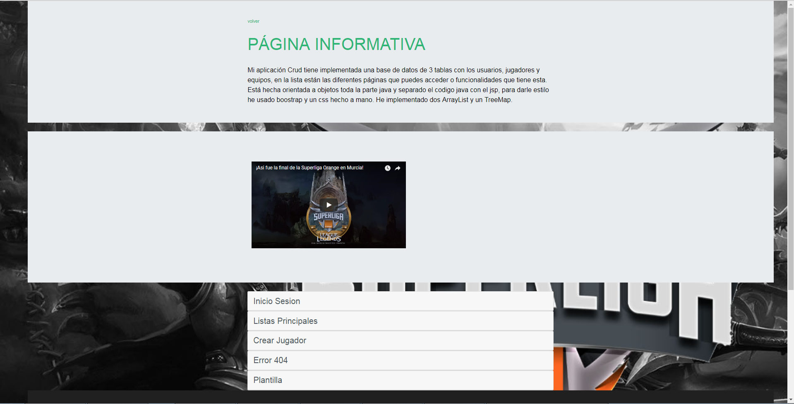
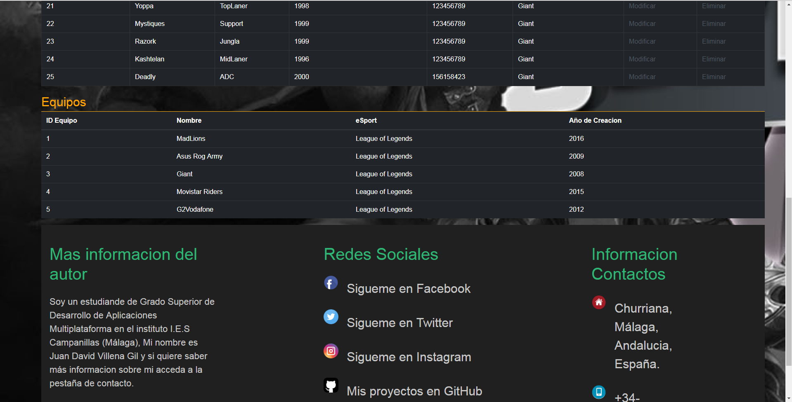
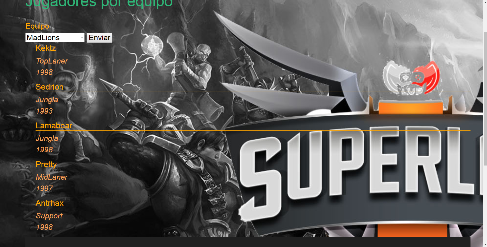

# Bienvenido a mi repositorio : Proyecto Crud II
Subida de la segunda parte del crud en esta subida he realizado cambios en la estructura interna ya que lo he hecho todo con servelt para separar el código java del jsp, es una practica con la que he aprendido mucho ya que de la forma que se nos explicó fue para hacer un CRUD básico y de la forma en que yo lo he hecho es más segura ya que no tiene nada de java en el código jsp.
<h2>Video de mi proyecto</h2>
<a href="https://youtu.be/idCMSO-o_ZU"> Pulsa aquí para ver mi demo del proyecto </a>
<h2>Galeria de Fotos</h2>

 He usado el HashMap para hacer una selecion del código equipo a modo de KEY y como valor he metido un ArrayList con todos los jugadores con el Código equipo que tiene la Key.

Para hacer el ArrayList lo que he hecho ha sido coger todos los jugadores que tengo almacenado en mi Base de datos y los he almacenado ahí. He usado otro ArrayList para los equipos. De esta forma si se introducen nuevos valores tanto en Equipos como en jugadores están actualizados.

